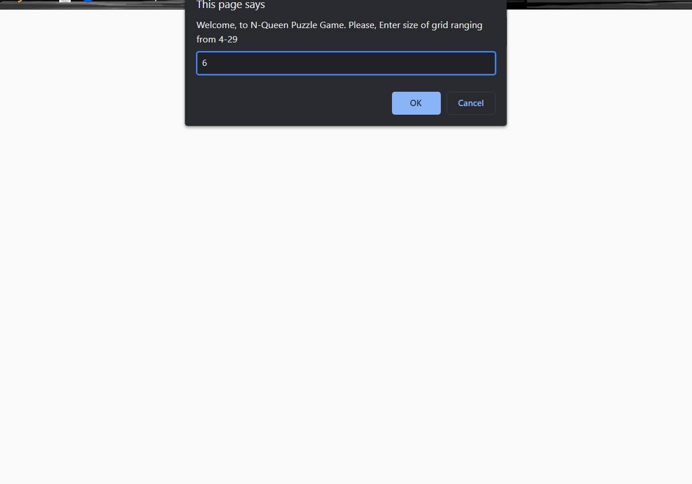
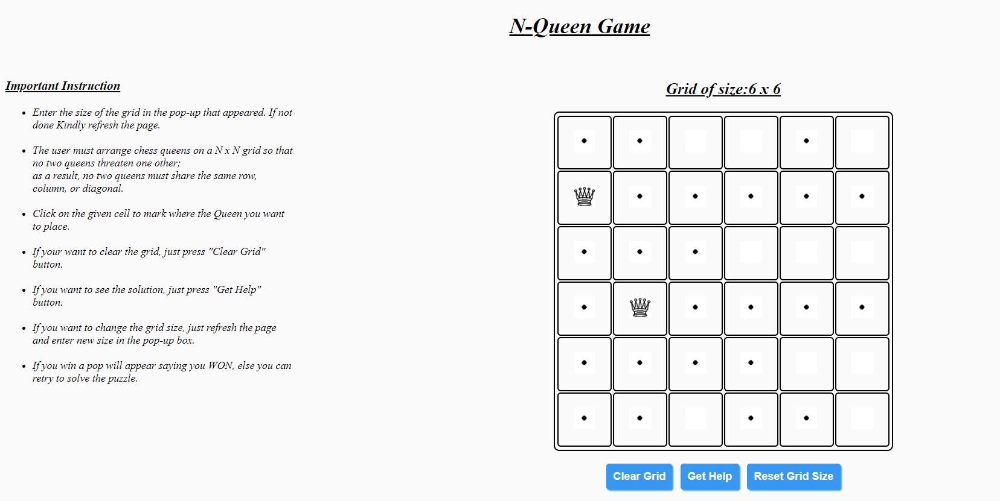
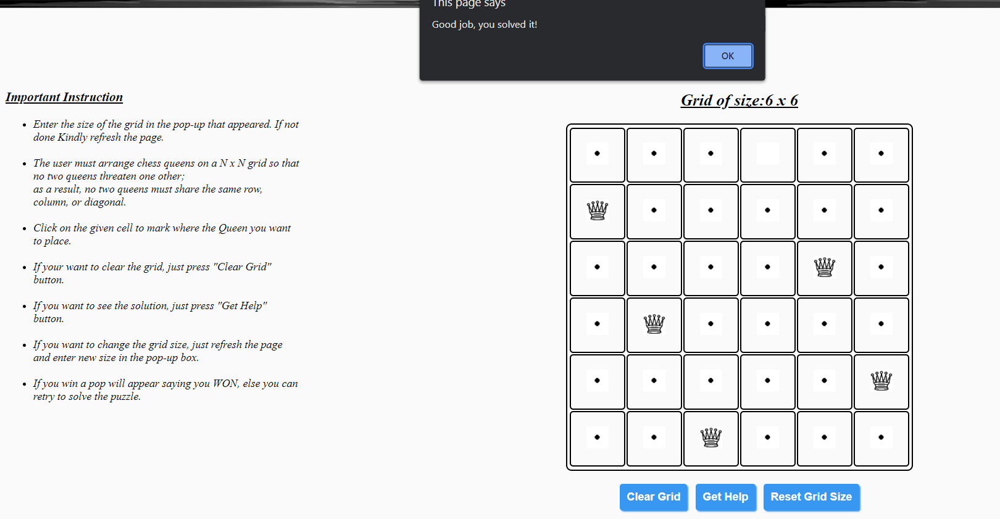

# N-Queen Puzzle Game
N-Queen Puzzle Game is a game based on the 8-Queen Puzzle published by chess composer Max Bezzel in 1848. This 8-Queen Puzzle game is extended to N-Queen Puzzle by Franz Nauck, person who published the solution of 8-Queen Puzzle in 1850.   
The basic idea behind the N-Queen problem is arranging N chess queens on a N x N chessboard in such a way that no two queens threaten one other; as a result, none of the two queens should share the same column, row, or diagonal. We will be using the concept <i>backtracking</i> for find the solution of the puzzle, through <i>Get Help</i> button. As well as, we can also solve the problem manually.

## Features :
<ul>
    <li>We can set the size of grid/chessboard <i>(recommended to set maximum grid size of 29 X 29)</i>.</li>
    <li>If we got stuck in while solving the puzzle, we can press <i>Get Help</i> button to view the solution of the puzzle.</li>
    <li>We can also clear the grid or chessboard using <i>Clear Grid</i> button while solving the puzzle, whenever we have moved the wrong step or we want to give another try to solve the same puzzle.</li>
</ul>

## Build With :
<ul>
    <li><a href="https://www.w3schools.com/html/" target="_blank">HTML</a></li>
    <li><a href="https://www.w3schools.com/css/" target="_blank">CSS</a></li>
    <li><a href="https://www.w3schools.com/js/" target="_blank">JavaScript</a></li>
</ul>

## Install and Run :
<ol>
    <li>Download the code and extract the zip file.</li>
    <li>Open the folder and double on the file named as <i>"index.html"</i> .</li>
    <li>You will see the page asking for the size of the gros or chessboard. Enter the size and hit OK.</li>
    <li>A greed/chessboard will be created on the right handside of the screen with rule/instruction on how to play game on the left handside of the screen</li>
    <li>After reading the rules/instruction you can start solving the puzzle.</li>
</ol>

## Instruction of Game :
<ol>
    <li>Enter the size of the grid in the pop-up that appeared. If not done Kindly refresh the page.</li>
    <li>The user must arrange chess queens on a N x N grid in such a manner so that no two queens threaten one other; as a result, no two queens must share the same row, column, or diagonal.</li>
    <li>Click on the given cell to mark where the Queen you want to place.</li>
    <li>If your want to clear the grid, just press <i>"Clear Grid"</i> button.</li>
    <li>If you want to see the solution, just press <i>"Get Help"</i> button.</li>
    <li>If you want to change the grid size, just click on the <i>Reset Grid Size</i> button and enter new size in the pop-up box and press OK.</li>
    <li>If you win a pop will appear saying you WON, else you can retry to solve the puzzle.</li>
</ol>

## Screenshot :
<ul>
    <li>Asking to enter grid size :   </li>
    <li>Solving Puzzle :   </li>
    <li>Message after solving the puzzle :   </li>
    <li>Using <i>Get Help</i> Button :   </li>
</ul>

